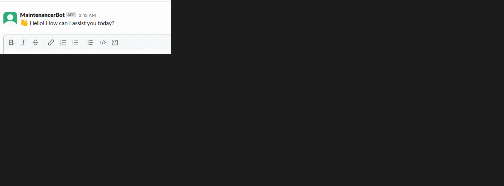

# Slack Assistant Bot with Gmail, Calendar, Trello, and Gemini Integration

---

## Overview

This Slack bot integrates with the following services:
- **Gmail**: Check and list unread emails.
- **Trello**: Search and create Trello cards.
- **Gemini**: Interact with Google's Gemini AI endpoint.
- **Groq (LLM API)**: Ask and receive responses from Groq-powered LLM.

---

## 🚀 Features

- `/hello` – Greet the user in Slack.
- `/inbox` – Fetch and display the latest unread emails from Gmail.
- `/meet {message}` – Use Gemini AI to extract meeting details and schedule a Google Meet.
- `/create_card_trello {message}` – Create a new Trello card based on the Slack command.
- `/trellosearch {message}` - search in Trello to match query
- `/trellocard {message}` - display card infomation
- `/gemini {message}` - Uses **Google Gemini API** for natural language understanding.
- `/ {message}` - Uses Groq for natural language understanding.

---
## 🔧 Setup

### 1. Environment Variables

Create a `.env` file or set these variables in your environment:

```bash
SLACK_BOT_TOKEN=your-slack-bot-token
SLACK_SIGNING_SECRET=your-slack-signing-secret
GOOGLE_CREDENTIALS=your-google-oauth-json
TRELLO_API_KEY=your-trello-api-key
TRELLO_TOKEN=your-trello-token
GEMINI_API_KEY=your-gemini-api-key
GROQ_API_KEY=your-groq-api-key
```

### 2. Install dependencies
```
pip install -r requirements.txt
```

### 3. Run code
```
python bot.py
ngrok http 3000
```

---

## 📨 Gmail Commands

### `/inbox`
- Checks number of unread emails in your inbox.
- Responds with a count or lists the top 5 unread email subjects.

---

## 🧩 Trello Commands

### `/trello_search <card_name>`
- Searches Trello for cards by name.
- Returns up to 5 matching Trello cards.

### `/create_card_trello <list_id> <card_title> [description]`
- Creates a Trello card under the provided list.

---

## 🌟 Gemini Commands

### `/ask_gemini <your question>`
- Sends a prompt to Google's Gemini AI.
- Responds with generated answer.

---

## 🚀 Groq Commands

### `/ask_groq <your question>`
- Uses Groq API to fetch a response from a Large Language Model (LLM).

---


---

## Resources
- [Slack API](https://api.slack.com/)
- [Create Slack Bot](https://medium.com/applied-data-science/how-to-build-you-own-slack-bot-714283fd16e5)
- [Video Tutorials](https://www.youtube.com/watch?v=KJ5bFv-IRFM&list=PLzMcBGfZo4-kqyzTzJWCV6lyK-ZMYECDc)
- [Google Oauth](https://developers.google.com/identity/protocols/oauth2)
- [Google Cloud Console](https://console.cloud.google.com/marketplace?inv=1&invt=Aby56w)
- [Google Developer API](https://developers.google.com/android-publisher/getting_started)


---

## 📂 Structure

```
project/
│
├── public/
├── app.py                  
├── .env   
├── client_secret.json                
└── requirements.txt
```

---

## 🧪 Testing

Use Slack slash commands to test each integration in your workspace.

Here is a GIF file that show Testing of this project<br>




---

## 📄 License

This project is under [MIT LICENSE](./LICENSE.md)
